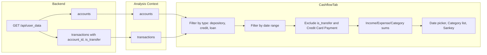

# Populate Cash Flow Tab with Date Filter and Account-Type Restriction (Updated)

## Overview

Populate the Cash Flow tab with real data: add a date range filter (defaulting to the latest calendar month with data), restrict to deposit/credit/loan accounts only, and drive the Category Breakdown (and future Sankey) from filtered transactions. **Backend must expose `account_id` and `is_transfer` for accurate filtering.** Income/Expense totals must exclude internal transfers and credit card payments.

---

## 1. Backend: Expose `account_id` and `is_transfer` (Mandatory)

**File:** [api/index.py](api/index.py)

- In `_db_txn_to_analysis`, the returned dict **must** include:
  - **`account_id`**: `t.get("account_id")` — so the frontend can filter by account type (depository, credit, loan).
  - **`is_transfer`**: `t.get("is_transfer", False)` — so the frontend can exclude internal transfers from income/expense and category totals.

Both fields are required for the React context and CashflowTab to accurately filter and aggregate data.

---

## 2. Frontend: Put `accounts` into analysis context

**File:** [frontend/src/context/AnalysisContext.js](frontend/src/context/AnalysisContext.js)

- Add state: `accounts` (e.g. `useState([])`).
- In `setAnalysisData`, set `accounts` from `data?.accounts ?? []`.
- In `clearAnalysis`, reset `accounts` to `[]`.
- Expose `accounts` from the context value.

**File:** [frontend/src/pages/dashboard/DataEditorTab.js](frontend/src/pages/dashboard/DataEditorTab.js)

- No code change needed: it already calls `setAnalysisData(res.data)`; `GET /api/user_data` already returns `accounts`.

---

## 3. CashflowTab: Data load, date range, account filter, and Income/Expense math

**File:** [frontend/src/pages/dashboard/CashflowTab.js](frontend/src/pages/dashboard/CashflowTab.js)

### Data source and filters

- Use `useAnalysis()` for `transactions` and `accounts`; if empty, call `GET /api/user_data` and `setAnalysisData(res.data)` (same pattern as DataEditorTab).
- **Account-type filter:** Restrict to accounts where `account_type` ∈ `['depository', 'credit', 'loan']`. Filter transactions to those whose `account_id` is in that set.
- **Date range:** State for `startDate` / `endDate`. Default = latest calendar month with data from the filtered transaction list. Add a date range picker at the top of the tab.
- **Date filter:** Restrict the account-type–filtered list to `date >= startDate` and `date <= endDate`.

### Income / Expense totals (Sankey / Summary) — strict exclusions

When building the data for the Sankey placeholder and any summary cards (Income, Expense, Savings), use **explicit exclusions** so internal transfers and credit card payments are never counted.

- **Exclude from both Income and Expense:**  
  Any transaction where `is_transfer === true` **OR** `category === 'Credit Card Payment'`.

- **Income calculation:**  
  Sum only **positive** amounts, and **exclude** every transaction where:
  - `is_transfer === true`, or
  - `category === 'Credit Card Payment'`  
  (A credit card payment appears as a positive inflow on a credit statement; counting it would double-count income.)

- **Expense calculation:**  
  Sum only **negative** amounts (as absolute or negative), and **exclude** every transaction where:
  - `is_transfer === true`, or
  - `category === 'Credit Card Payment'`  
  (The payment from chequing to the card is not an expense; the underlying purchases on the card are already expenses.)

**Implementation:** Use `reduce` or a clear `filter` + `reduce` when building the Sankey/summary object. Before adding a transaction to the income or expense sum, explicitly check:

```js
const excludeFromIncomeExpense = (tx) =>
  tx.is_transfer === true || (tx.category && tx.category === 'Credit Card Payment');
```

Then:

- **Income:** sum over filtered list where `amount > 0` and `!excludeFromIncomeExpense(tx)`.
- **Expense:** sum over filtered list where `amount < 0` and `!excludeFromIncomeExpense(tx)`.

Category breakdown for the list can use the same exclusion (exclude `is_transfer` and `Credit Card Payment` from category sums) so the breakdown matches the Income/Expense logic.

---

## 4. Category breakdown and UI

- **Category breakdown:** From the date- and account-type–filtered list, aggregate by `category` (applying the same exclusions: `is_transfer` and `Credit Card Payment`), then sort and render in the existing Category Breakdown section (replace mock data).
- **Sankey placeholder:** Pass the computed Income and Expense (and Savings = Income − Expense) into the placeholder so it can show real totals when you’re ready.
- **Edge cases:** No data / no eligible accounts → show empty state; optionally hide or disable date filter until data exists.

---

## 5. Summary of files to touch

| Layer   | File | Change |
|---------|------|--------|
| Backend | [api/index.py](api/index.py) | **Mandatory:** In `_db_txn_to_analysis`, add `account_id` and `is_transfer` to the returned dict. |
| Frontend | [frontend/src/context/AnalysisContext.js](frontend/src/context/AnalysisContext.js) | Add `accounts` state; set/clear in `setAnalysisData` / `clearAnalysis`; expose in context. |
| Frontend | [frontend/src/pages/dashboard/CashflowTab.js](frontend/src/pages/dashboard/CashflowTab.js) | Use `transactions` + `accounts`; fetch `user_data` if missing; date range + filter by account type and date; **strict Income/Expense logic excluding `is_transfer` and `category === 'Credit Card Payment'`** in reduce/filter for Sankey/summary; category breakdown with same exclusions; remove mock data. |
| Optional | [frontend/src/components/SankeyPlaceholder.js](frontend/src/components/SankeyPlaceholder.js) | Accept props (income, expenses, savings) and display them. |

---

## Data flow (high level)


